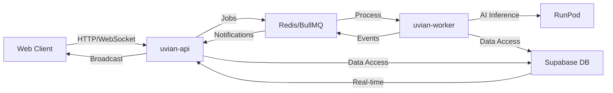
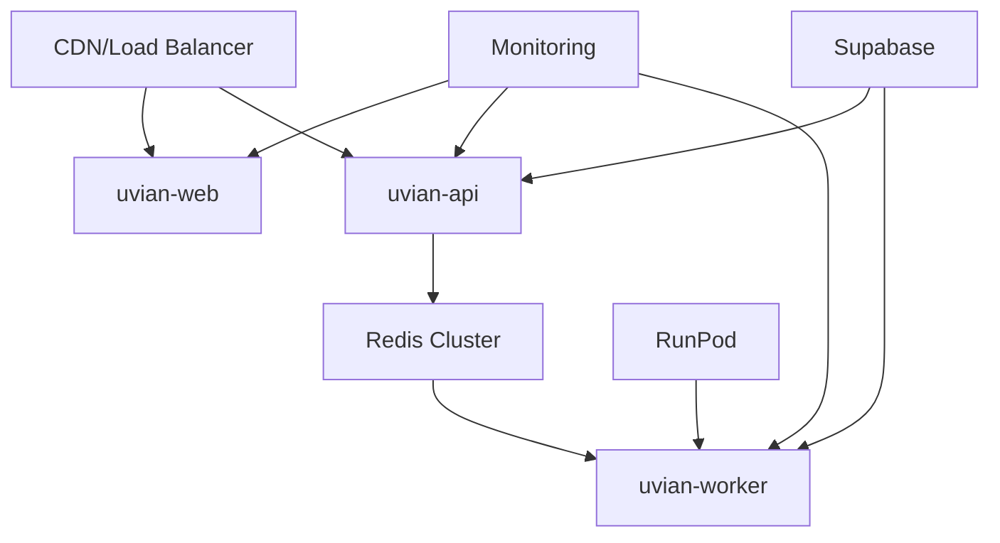

# Uvian - Real-time Chat Platform

[](https://opensource.org/licenses/MIT)
[](https://www.typescriptlang.org/)
[](https://nextjs.org/)
[](https://www.fastify.io/)
[](https://www.python.org/)
[](https://nx.dev/)
[](https://redis.io/)
[](https://www.postgresql.org/)
[](https://supabase.com/)

**Uvian** is a sophisticated full-stack real-time chat platform built with modern technologies and enterprise-grade architecture patterns. It supports both human users and AI agents in a collaborative environment with spaces, conversations, and real-time messaging capabilities.

## ✨ Key Features

- 🤖 **AI-Powered Chat**: Integrated with RunPod for intelligent AI responses
- 💬 **Real-time Messaging**: Socket.io with Redis scaling for instant communication
- 🏢 **Team Workspaces**: Organize conversations in dedicated spaces
- 🔐 **Enterprise Security**: Supabase Auth with role-based access control
- 📱 **Responsive Design**: Mobile-first UI with shadcn/ui components
- 🏗️ **Microservices Architecture**: Scalable service-oriented design
- 🔄 **Job Queue Processing**: BullMQ for reliable background task handling
- 🎯 **Domain-Driven Architecture**: Clean separation of business logic

---

## 🚀 Quick Start

### Prerequisites

| Tool             | Version | Purpose                                |
| ---------------- | ------- | -------------------------------------- |
| Node.js          | 18+     | Frontend and API runtime               |
| Python           | 3.11+   | Background worker runtime              |
| Redis            | 6+      | Job queues and real-time caching       |
| Supabase Account | -       | Database, auth, and real-time features |

### Step-by-Step Installation

#### 1. Clone Repository

```bash
git clone <repository-url>
cd uvian
```

#### 2. Install Dependencies

```bash
# Install Node.js dependencies
npm install

# Install Python dependencies
cd apps/uvian-worker
poetry install --with dev
cd ../../
```

#### 3. Environment Setup

```bash
# Copy environment template
cp .env.example .env.local

# Edit environment variables
nano .env.local  # or your preferred editor
```

#### 4. Database Setup

```bash
# Create a new Supabase project at https://supabase.com
# Run the SQL schema from database_schema.sql in your Supabase SQL editor
```

#### 5. Start Development

```bash
# Start all applications
nx run-many -t serve -p=uvian-api,uvian-web,uvian-worker

# Or start individual services
nx serve uvian-web    # Frontend on http://localhost:3000
nx serve uvian-api    # API on http://localhost:3001
nx serve uvian-worker # Worker (no web interface)
```

### First Steps

1. **Open Frontend**: Navigate to http://localhost:3000
2. **Create Account**: Use the authentication system
3. **Join/Space**: Create or join a workspace
4. **Start Chat**: Begin real-time messaging with AI

---

## 🏗️ Architecture Overview

### Service Communication Flow



### Monorepo Structure

```
📁 apps/                    # 3 applications
  ├── uvian-api/           # Fastify API server (Node.js)
  ├── uvian-web/           # Next.js web application (React)
  └── uvian-worker/        # Python background worker

📁 packages/               # Shared libraries
  └── ui/                  # shadcn/ui component library

📁 .agents/                # AI agent configuration and rules
📁 analysis/               # Analysis tools
📁 reports/                # Build and test reports
```

## 🔧 Technology Stack

### **Frontend - uvian-web**

| Technology           | Purpose           | Version |
| -------------------- | ----------------- | ------- |
| **Next.js**          | React framework   | 16      |
| **React**            | UI library        | 19      |
| **TypeScript**       | Type safety       | 5.9+    |
| **Tailwind CSS**     | Styling           | 3.4+    |
| **shadcn/ui**        | Component library | Latest  |
| **Zustand**          | State management  | Latest  |
| **TanStack Query**   | Server state      | Latest  |
| **React Hook Form**  | Form handling     | Latest  |
| **Zod**              | Validation        | Latest  |
| **Socket.io Client** | Real-time comms   | Latest  |
| **Supabase Auth**    | Authentication    | Latest  |

### **Backend API - uvian-api**

| Technology     | Purpose           | Version |
| -------------- | ----------------- | ------- |
| **Fastify**    | Web framework     | 4.29+   |
| **TypeScript** | Type safety       | 5.9+    |
| **Socket.io**  | WebSocket server  | Latest  |
| **BullMQ**     | Job queue         | 5.67+   |
| **Redis**      | Caching & pub/sub | 6+      |
| **Supabase**   | Database & auth   | Latest  |
| **ESBuild**    | Bundling          | 0.19+   |
| **SWC**        | Compilation       | 1.5+    |

### **Background Worker - uvian-worker**

| Technology        | Purpose            | Version       |
| ----------------- | ------------------ | ------------- |
| **Python**        | Runtime            | 3.11+         |
| **Poetry**        | Package management | Latest        |
| **asyncio**       | Async framework    | Built-in      |
| **BullMQ**        | Job processing     | Python client |
| **RunPod Client** | AI inference       | Custom        |
| **Supabase**      | Database           | Python client |

### **Database & Infrastructure**

| Service            | Technology            | Purpose              |
| ------------------ | --------------------- | -------------------- |
| **Database**       | PostgreSQL (Supabase) | Primary data store   |
| **Real-time**      | WebSocket (Socket.io) | Live messaging       |
| **Caching**        | Redis                 | Session & queue data |
| **Authentication** | Supabase Auth         | User management      |
| **AI Inference**   | RunPod                | Model serving        |
| **Build System**   | Nx                    | Monorepo management  |

## 🛠️ Development Commands

### Starting Applications

```bash
# Start all applications
nx run-many -t serve -p=uvian-api,uvian-web,uvian-worker

# Start individual services
nx serve uvian-web    # Frontend (http://localhost:3000)
nx serve uvian-api    # API (http://localhost:3001)
nx serve uvian-worker # Background worker

# Start worker with specific command
nx start-worker uvian-worker
```

### Building & Testing

```bash
# Build all applications
nx run-many -t build -p=uvian-api,uvian-web,uvian-worker

# Build specific application
nx build uvian-web
nx build uvian-api
nx build uvian-worker

# Run tests
nx test uvian-web        # All tests for web
nx test uvian-api        # All tests for API
nx test uvian-worker     # All tests for worker

# Run specific test file
nx test uvian-api --testPathPattern=app.spec.ts

# Type checking
nx run-many -t typecheck -p=uvian-api,uvian-web,uvian-worker

# Linting
nx lint uvian-web        # Lint web app
nx lint uvian-api        # Lint API
nx lint                  # Lint all projects
```

### Worker-Specific Commands

```bash
# Install Python dependencies
nx install uvian-worker

# Run Python tests with Poetry
cd apps/uvian-worker && poetry run pytest

# Run with coverage
poetry run pytest --cov=apps.uvian_worker

# Poetry shell for development
poetry shell
```

### Database Management

```bash
# The database schema is managed through Supabase
# Run the SQL from database_schema.sql in your Supabase SQL editor

# For local development, you can also:
# - Create tables manually
# - Use Supabase CLI for local development
# - Import/export data as needed
```

## ⚙️ Core Architectural Patterns

### **1. Feature-Driven Architecture**

The frontend follows strict separation between **encapsulated domain logic** and **feature-driven orchestration**:

- **Domain Sandbox Rule**: Complete isolation between business domains
- **Hook Bridge Rule**: Feature components use orchestrator hooks, not direct API calls
- **Transformer Rule**: API data transformation before reaching components
- **Strict separation of concerns** between domains, features, and infrastructure

### **2. Domain Organization**

```
lib/domains/[domain]/
  ├── api/                 # TanStack Query queries & mutations
  ├── store/               # Zustand store slices
  ├── types.ts            # Domain-specific types
  └── utils.ts            # Data transformers (apiToUi)
```

### **3. Feature Layer**

```
components/features/[feature]/
  ├── hooks/              # Feature orchestrators
  ├── components/         # UI components
  ├── index.ts            # Public API
  └── types.ts            # Feature-specific types
```

## 📋 Application Features

### **uvian-web - Frontend Application**

#### **🔐 Authentication System**

- `/auth/sign-in` - User login with Supabase Auth
- `/auth/sign-up` - User registration with email confirmation
- `/auth/reset-password` - Password reset functionality
- `/auth/confirm-sign-up` - Email verification handling

#### **🖥️ Main Application Interface**

| Route                  | Purpose              | Features                                  |
| ---------------------- | -------------------- | ----------------------------------------- |
| `/`                    | Dashboard            | Conversation overview, recent activity    |
| `/profile`             | Profile Management   | View and edit user information            |
| `/settings`            | Application Settings | Preferences and configuration             |
| `/chats`               | Conversation List    | Browse and manage all conversations       |
| `/chats/[id]`          | Chat Interface       | Real-time messaging with AI support       |
| `/chats/[id]/members`  | Chat Management      | Participant management and permissions    |
| `/spaces`              | Workspace Browser    | Team and organization management          |
| `/spaces/[id]`         | Workspace View       | Space-specific conversations and settings |
| `/spaces/[id]/members` | Member Management    | User roles and permissions                |

#### **💬 Chat Features**

- Real-time messaging with WebSocket connections
- AI-powered responses with streaming support
- Message threading and conversation history
- File sharing and media support
- Typing indicators and presence status

### **uvian-api - Backend API Service**

#### **🛣️ Core API Endpoints**

| Endpoint    | Methods                | Purpose                             |
| ----------- | ---------------------- | ----------------------------------- |
| `/`         | GET                    | Health check and API documentation  |
| `/chat`     | GET, POST, PUT, DELETE | Conversation and message management |
| `/profiles` | GET, PUT               | User profile operations             |
| `/spaces`   | GET, POST, PUT, DELETE | Workspace management                |
| `/jobs`     | POST, GET              | Job queue submission and status     |

#### **⚙️ Service Architecture**

**Core Services:**

- **ChatService**: Message handling and conversation management
- **ProfileService**: User profile operations with Supabase integration
- **SpacesService**: Workspace functionality and member management
- **QueueService**: BullMQ job creation and management

**Fastify Plugins:**

- **SupabasePlugin**: Database integration with TypeScript types
- **AuthPlugin**: JWT authentication middleware
- **BullMQPlugin**: Redis-based job queue infrastructure
- **SocketioPlugin**: WebSocket server with Redis adapter
- **RedisPlugin**: Pub/Sub for real-time communication
- **SensiblePlugin**: Fastify configuration and error handling

#### **🔌 Real-time Features**

- WebSocket server with Socket.io
- Room-based communication by conversation
- JWT authentication for WebSocket connections
- Redis adapter for horizontal scaling
- Access control with conversation membership verification

### **uvian-worker - Background Processing**

#### **🤖 AI Integration**

- **RunPod Client**: HTTP client for AI model inference
- **Streaming Support**: Real-time token streaming from AI models
- **Context Management**: Conversation history for AI responses
- **Error Handling**: Comprehensive exception management
- **Cold Start Management**: Timeout handling for model initialization

#### **📊 Data Processing**

- **Repository Pattern**: Clean data access with dedicated repositories
  - `JobRepository`: Background job management
  - `ConversationRepository`: Chat conversation handling
  - `MessageRepository`: Message CRUD operations
- **Async Architecture**: Full asyncio implementation
- **Event System**: Redis Pub/Sub for real-time updates

#### **🔄 Job Processing Flow**

```typescript
// API creates job
1. User sends message → API validates → Stores in Supabase
2. API creates BullMQ job → Worker fetches job
3. Worker calls RunPod → AI processes message
4. Worker saves response → Publishes via Redis
5. API receives update → Broadcasts to WebSocket clients
```

#### **⚡ Performance Features**

- Async/await pattern for concurrent processing
- Job retry mechanisms with exponential backoff
- Connection pooling for database operations
- Memory-efficient streaming for large responses

---

## 📚 Application Documentation

### **Detailed Application Guides**

Each application has its own comprehensive documentation:

#### **📱 Frontend Application - uvian-web**

- **Location**: [`apps/uvian-web/README.md`](apps/uvian-web/README.md)
- **Guide**: [`apps/uvian-web/AGENTS.md`](apps/uvian-web/AGENTS.md)
- **Description**: Next.js 16 frontend with React 19, featuring domain-driven architecture, real-time messaging, and responsive UI components

**Key Topics Covered:**

- Domain-driven frontend architecture
- Feature-based component organization
- State management with Zustand and TanStack Query
- Real-time Socket.io integration
- Authentication and user management
- Testing strategies and patterns

#### **🔧 Backend API - uvian-api**

- **Location**: [`apps/uvian-api/README.md`](apps/uvian-api/README.md)
- **Guide**: [`apps/uvian-api/AGENTS.md`](apps/uvian-api/AGENTS.md)
- **Description**: Fastify-based API service with plugin architecture, WebSocket support, and BullMQ job queue integration

**Key Topics Covered:**

- Plugin-based Fastify architecture
- RESTful API design patterns
- WebSocket real-time communication
- Job queue management with BullMQ
- Database integration with Supabase
- Authentication middleware implementation

#### **⚙️ Background Worker - uvian-worker**

- **Location**: [`apps/uvian-worker/README.md`](apps/uvian-worker/README.md)
- **Guide**: [`apps/uvian-worker/AGENTS.md`](apps/uvian-worker/AGENTS.md)
- **Description**: Python background processing service with AI integration, repository patterns, and async job handling

**Key Topics Covered:**

- Repository and executor patterns
- AI integration with RunPod
- Async job processing with BullMQ
- Event-driven architecture
- Performance optimization
- Testing strategies for async Python

### **Getting Started with Each Application**

#### **For Frontend Development**

```bash
# Navigate to frontend directory
cd apps/uvian-web

# Install dependencies
npm install

# Start development server
nx serve uvian-web

# Read frontend-specific documentation
cat apps/uvian-web/README.md
```

#### **For Backend Development**

```bash
# Navigate to API directory
cd apps/uvian-api

# Install dependencies
npm install

# Start API server
nx serve uvian-api

# Read API-specific documentation
cat apps/uvian-api/README.md
```

#### **For Worker Development**

```bash
# Navigate to worker directory
cd apps/uvian-worker

# Install Python dependencies
poetry install --with dev

# Start worker
nx start-worker uvian-worker

# Read worker-specific documentation
cat apps/uvian-worker/README.md
```

### **Architecture Guidelines**

For comprehensive architecture patterns and development guidelines:

- **Root Architecture**: [`.agents/rules/architecture.md`](.agents/rules/architecture.md)
- **Agent Guidelines**: [`AGENTS.md`](AGENTS.md)

### **Application-Specific Agent Support**

Each application includes detailed `AGENTS.md` files with:

- Technology-specific development commands
- Code style and naming conventions
- Common patterns and anti-patterns
- Troubleshooting guides
- Performance optimization tips
- Testing strategies

## 🗄️ Database Schema

The project uses a comprehensive PostgreSQL schema (28KB+ file) managed through Supabase, supporting:

### **Core Entities**

| Table                  | Purpose                                    | Key Features                            |
| ---------------------- | ------------------------------------------ | --------------------------------------- |
| `profiles`             | User profiles with role-based types        | Human, agent, system, admin types       |
| `conversations`        | Chat conversations with metadata           | Threading, private/public, AI-enabled   |
| `messages`             | Individual messages with threading support | Rich content, attachments, AI responses |
| `spaces`               | Team workspaces and organization units     | Multi-tenant, role-based access         |
| `space_members`        | Workspace membership management            | Roles: owner, admin, member, guest      |
| `jobs`                 | Background job processing queue            | Async processing, retry mechanisms      |
| `conversation_members` | Conversation participant tracking          | Access control, permissions             |

### **Database Features**

- **Row Level Security (RLS)**: Supabase policies for data protection
- **Real-time Subscriptions**: Live updates for messaging and presence
- **Multi-tenant Architecture**: Data isolation by workspace/space
- **Audit Trails**: Comprehensive logging for compliance
- **Scalability**: Optimized indexes for high-performance queries

### **Schema Setup**

```sql
-- The complete schema is in database_schema.sql
-- Run this in your Supabase SQL editor to set up the database

-- Example: Create the profiles table
CREATE TABLE profiles (
  id UUID REFERENCES auth.users(id) PRIMARY KEY,
  username TEXT UNIQUE NOT NULL,
  full_name TEXT,
  avatar_url TEXT,
  type profile_type NOT NULL DEFAULT 'human',
  created_at TIMESTAMP WITH TIME ZONE DEFAULT NOW(),
  updated_at TIMESTAMP WITH TIME ZONE DEFAULT NOW()
);
```

## ⚙️ Environment Configuration

### **Required Environment Variables**

#### **uvian-api Environment**

```env
# Database Configuration
SUPABASE_URL=https://your-project.supabase.co
SUPABASE_PUBLISHABLE_KEY=your_publishable_key
SUPABASE_SERVICE_ROLE_KEY=your_service_role_key

# Redis Configuration
REDIS_HOST=localhost
REDIS_PORT=6379
REDIS_PASSWORD=your_redis_password

# Authentication
NEXTAUTH_SECRET=your_nextauth_secret
NEXTAUTH_URL=http://localhost:3000

# Job Queue
REDIS_URL=redis://localhost:6379
```

#### **uvian-worker Environment**

```env
# Database Configuration
SUPABASE_URL=https://your-project.supabase.co
SUPABASE_SERVICE_ROLE_KEY=your_service_role_key

# Redis Configuration
REDIS_HOST=localhost
REDIS_PORT=6379
REDIS_PASSWORD=your_redis_password

# AI Integration (RunPod)
RUNPOD_API_KEY=your_runpod_api_key
RUNPOD_ENDPOINT_ID=your_endpoint_id
RUNPOD_ENDPOINT_URL=https://your-endpoint-url
```

#### **uvian-web Environment**

```env
# Supabase Configuration
NEXT_PUBLIC_SUPABASE_URL=https://your-project.supabase.co
NEXT_PUBLIC_SUPABASE_ANON_KEY=your_anon_key

# API Configuration
NEXT_PUBLIC_API_URL=http://localhost:3001

# Application Settings
NEXT_PUBLIC_APP_URL=http://localhost:3000
```

### **Configuration Files**

| File                  | Purpose                    | Location   |
| --------------------- | -------------------------- | ---------- |
| `nx.json`             | Nx workspace configuration | Root       |
| `components.json`     | shadcn/ui configuration    | Web app    |
| `tailwind.config.js`  | Tailwind CSS setup         | Web app    |
| `database_schema.sql` | Complete PostgreSQL schema | Root       |
| `eslint.config.mjs`   | ESLint rules and config    | Root       |
| `jest.config.ts`      | Jest testing configuration | Root       |
| `pyproject.toml`      | Python dependencies        | Worker app |
| `.env.example`        | Environment template       | Root       |

### **Setup Instructions**

1. **Copy Environment Template**

   ```bash
   cp .env.example .env.local
   ```

2. **Configure Supabase**

   - Create project at [supabase.com](https://supabase.com)
   - Get URL and API keys from project settings
   - Run `database_schema.sql` in SQL editor

3. **Set Up Redis**

   ```bash
   # Using Docker
   docker run -d -p 6379:6379 redis:latest

   # Or install locally
   # Follow Redis installation for your OS
   ```

4. **Configure AI Integration**

   - Sign up at [runpod.ai](https://runpod.ai)
   - Deploy your AI model
   - Get API key and endpoint URL

5. **Install Dependencies**
   ```bash
   npm install
   cd apps/uvian-worker && poetry install --with dev
   ```

## 📊 Project Status

### **✅ Production Ready**

- **Core Infrastructure**: Nx monorepo, comprehensive database schema, authentication
- **UI Component Library**: shadcn/ui with complete component set
- **Backend API**: Fastify server with comprehensive routing and plugins
- **Real-time Infrastructure**: Socket.io integration with Redis scaling
- **Domain Architecture**: Feature-driven structure with strict separation
- **Background Worker**: Python worker with AI integration ready

### **🔄 In Development**

- **Domain Implementation**: Chat and Spaces domains structured, feature completion ongoing
- **Feature Components**: UI components following established patterns
- **Real-time Features**: WebSocket integration and live updates

### **⚠️ Needs Attention**

- **Test Coverage**: Limited test files, needs comprehensive test suite
- **Documentation**: User and API documentation incomplete
- **Package Publishing**: UI package minimal configuration
- **CI/CD Pipeline**: No visible GitHub Actions or deployment pipeline
- **Error Handling**: Centralized error handling and logging needed
- **Monitoring**: Application monitoring and observability missing

## 🎨 Development Standards

### **Code Quality**

- **TypeScript**: Strict typing throughout the entire stack
- **ESLint + Prettier**: Consistent code formatting and linting
- **Jest**: Testing framework for unit and integration tests
- **SWC**: Fast compilation and transpilation

### **UI/UX Standards**

- **shadcn/ui**: Consistent component library based on Radix UI
- **Tailwind CSS**: Utility-first styling with custom design tokens
- **Lucide React**: Consistent icon library
- **Responsive Design**: Mobile-first responsive patterns

### **Architecture Enforcement**

- **Domain Separation**: Strict isolation prevents tight coupling
- **Feature Orchestration**: Clean component boundaries and separation
- **API Transformation**: Maintains data integrity and type safety
- **Monorepo Benefits**: Shared dependencies and optimized builds

## 🚢 Production Deployment

### **Deployment Architecture**



### **Recommended Deployment Stack**

| Service          | Platform                | Purpose                 | Notes                             |
| ---------------- | ----------------------- | ----------------------- | --------------------------------- |
| **Frontend**     | Vercel/Netlify          | Next.js hosting         | Automatic SSL, global CDN         |
| **API**          | Railway/Render/Heroku   | Fastify server          | Auto-scaling, easy deployment     |
| **Worker**       | AWS ECS/Fargate         | Python background tasks | Container orchestration           |
| **Database**     | Supabase                | PostgreSQL hosting      | Built-in auth, real-time features |
| **Cache**        | Redis Cloud/ElastiCache | Redis hosting           | High availability, persistence    |
| **AI Inference** | RunPod                  | Model serving           | GPU instances, API endpoints      |

### **Deployment Steps**

#### **1. Environment Setup**

```bash
# Production environment variables
export SUPABASE_URL="https://your-prod-project.supabase.co"
export SUPABASE_SERVICE_ROLE_KEY="your-production-service-key"
export REDIS_URL="redis://your-redis-cluster:6379"
export RUNPOD_API_KEY="your-production-runpod-key"
```

#### **2. Database Migration**

```bash
# Deploy schema to production
# Run database_schema.sql in Supabase production instance

# Verify tables created
psql "your-connection-string" -c "\dt"
```

#### **3. Application Deployment**

**uvian-web (Frontend):**

```bash
# Build and deploy to Vercel
npm run build
vercel --prod

# Environment variables in Vercel dashboard:
NEXT_PUBLIC_SUPABASE_URL=
NEXT_PUBLIC_SUPABASE_ANON_KEY=
NEXT_PUBLIC_API_URL=
```

**uvian-api (Backend):**

```bash
# Deploy to Railway/Render
railway up
# or
render deploy

# Set environment variables in platform dashboard
```

**uvian-worker (Python):**

```bash
# Build Docker image
docker build -t uvian-worker .
docker push your-registry/uvian-worker

# Deploy to ECS/Fargate
aws ecs update-service --cluster production --service uvian-worker
```

### **Production Configuration**

#### **Performance Optimizations**

1. **Database Optimization**

   - Enable connection pooling in Supabase
   - Create appropriate indexes for frequent queries
   - Use read replicas for heavy read operations

2. **Caching Strategy**

   - Redis clustering for high availability
   - Session storage in Redis
   - API response caching where appropriate

3. **Real-time Scaling**
   - Socket.io Redis adapter for multi-instance support
   - WebSocket connection limits per instance
   - Load balancer configuration for sticky sessions

#### **Security Considerations**

1. **Authentication & Authorization**

   - JWT secret rotation
   - Supabase RLS policies for data isolation
   - CORS configuration for production domains

2. **Network Security**

   - HTTPS everywhere (SSL certificates)
   - API rate limiting
   - Web application firewall (WAF)

3. **Data Protection**
   - Environment variable security
   - Database encryption at rest
   - Regular security audits

#### **Monitoring & Observability**

1. **Application Monitoring**

   ```typescript
   // API metrics
   - Response times
   - Error rates
   - WebSocket connections
   - Queue processing metrics

   // Worker metrics
   - Job success/failure rates
   - Processing time
   - Memory usage
   - AI inference latency
   ```

2. **Infrastructure Monitoring**

   - CPU/Memory usage per service
   - Database performance metrics
   - Redis connection and memory usage
   - Network latency and throughput

3. **Logging Strategy**
   ```typescript
   // Structured logging
   {
     "timestamp": "2024-01-01T00:00:00Z",
     "service": "uvian-api",
     "level": "info",
     "message": "Message processed",
     "conversationId": "conv_123",
     "userId": "user_456"
   }
   ```

### **Scaling Patterns**

#### **Horizontal Scaling**

- **Load Balancer**: Distribute traffic across API instances
- **WebSocket Clustering**: Redis pub/sub for real-time communication
- **Worker Pool**: Multiple worker instances for job processing
- **Database Sharding**: Consider partitioning by tenant/space

#### **Vertical Scaling**

- **Memory Optimization**: Increase worker memory for AI processing
- **CPU Optimization**: Scale API instances for high request rates
- **Storage Scaling**: Upgrade Supabase plan for higher concurrency

#### **Cost Optimization**

- **Auto-scaling**: Scale down during low traffic
- **Spot Instances**: Use for worker deployment
- **CDN Caching**: Reduce API calls through caching
- **Resource Monitoring**: Track and optimize usage

### **Troubleshooting**

#### **Common Issues**

1. **WebSocket Connection Drops**

   ```bash
   # Check Redis connectivity
   redis-cli ping

   # Verify Socket.io adapter
   curl -I https://your-api.com/socket.io/
   ```

2. **Job Processing Failures**

   ```bash
   # Check worker logs
   kubectl logs -f deployment/uvian-worker

   # Monitor queue status
   redis-cli llen "bull:main-queue"
   ```

3. **Database Connection Issues**

   ```bash
   # Test Supabase connection
   psql "postgresql://..." -c "SELECT 1;"

   # Check connection pool status
   # View in Supabase dashboard
   ```

#### **Performance Tuning**

- **Database Queries**: Use Supabase query analyzer
- **API Response Times**: Enable Fastify logging
- **Worker Throughput**: Monitor job queue length
- **Memory Usage**: Profile Python worker memory consumption

## 🤝 Contributing

1. Follow the established domain architecture patterns
2. Use the feature-driven structure for new functionality
3. Ensure all new code includes TypeScript types
4. Write tests for new features and utilities
5. Follow the existing code style and conventions

## 📄 License

This project is licensed under the MIT License - see the [LICENSE](LICENSE) file for details.

## 🙏 Acknowledgments

- **shadcn/ui** for the excellent component library
- **Supabase** for the backend infrastructure
- **Nx** for the powerful monorepo management
- **Fastify** for the high-performance Node.js framework
- **Next.js** for the React application framework

---

**Built with ❤️ using modern web technologies and enterprise-grade architecture patterns.**
