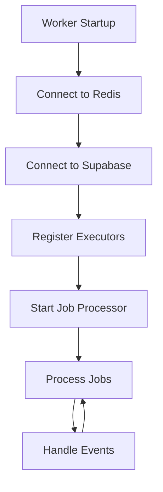

# Uvian Worker - Python Background Processing

[](https://www.python.org/)
[](https://python-poetry.org/)
[](https://docs.bullmq.io/)
[](https://runpod.ai/)
[](https://redis.io/)
[](https://supabase.com/)

**Uvian Worker** is the Python background processing service of the Uvian real-time chat platform. It handles AI-powered chat processing, job queue management, and asynchronous operations using BullMQ, Redis, and integrations with RunPod for AI inference.

## 🚀 Quick Start

### Prerequisites

- Python 3.11+
- Poetry package manager
- Redis server (for job queues)
- Supabase project setup
- Running `uvian-api` service (port 3001)

### Installation & Development

```bash
# From the workspace root
nx serve uvian-worker

# Or navigate to app directory
cd apps/uvian-worker
poetry install --with dev
poetry run python apps/uvian_worker/main.py

# Or use the specific start command
nx start-worker uvian-worker
```

### Health Check

```bash
# The worker doesn't expose HTTP endpoints
# Check logs for worker status
# Look for messages like:
# "Worker started successfully"
# "Connected to Redis"
# "Connected to Supabase"
```

### Building for Production

```bash
# Install dependencies
nx install uvian-worker

# Build worker
nx build uvian-worker

# Run production build
poetry run python apps/uvian_worker/main.py
```

---

## 🏗️ Architecture Overview

### **Technology Stack**

| Technology        | Version  | Purpose                             |
| ----------------- | -------- | ----------------------------------- |
| **Python**        | 3.11+    | Runtime environment                 |
| **Poetry**        | Latest   | Package management and dependencies |
| **BullMQ**        | Latest   | Redis-based job queue system        |
| **Redis**         | 6+       | Job queue backend and pub/sub       |
| **asyncio**       | Built-in | Asynchronous programming framework  |
| **HTTPX**         | Latest   | Async HTTP client for external APIs |
| **Supabase**      | Latest   | PostgreSQL database client          |
| **RunPod Client** | Custom   | AI model inference integration      |

### **Application Structure**

```
apps/uvian_worker/
├── main.py                     # Worker entry point
├── core/                       # Core infrastructure
│   ├── config.py              # Configuration management
│   ├── db.py                  # Database utilities
│   └── events.py              # Event system (Redis pub/sub)
├── clients/                   # External service clients
│   ├── runpod.py              # RunPod AI client integration
│   └── supabase.py            # Supabase client
├── executors/                 # Job executors
│   ├── base.py               # Base executor interface
│   └── chat_executor.py      # Chat-specific executor
├── repositories/              # Data access layer
│   ├── conversations.py      # Conversation repository
│   ├── messages.py           # Message repository
│   └── jobs.py               # Job repository
└── tests/                     # Test suite
    └── test_hello.py         # Basic test examples
```

### **Core Architecture Patterns**

#### **1. Repository Pattern**

Clean data access with dedicated repositories for each entity:

- **JobRepository**: Background job management and status tracking
- **ConversationRepository**: Chat conversation handling
- **MessageRepository**: Message CRUD operations

#### **2. Executor Pattern**

Modular job processing with specialized executors:

- **BaseExecutor**: Abstract base class defining the executor interface
- **ChatExecutor**: Specialized executor for AI chat processing

#### **3. Event-Driven Architecture**

Redis pub/sub for inter-service communication:

- **Event Publishing**: Worker publishes events for API consumption
- **Event Subscription**: Worker subscribes to system events

---

## ⚙️ Job Processing Pipeline

### **Worker Lifecycle**



### **Job Processing Flow**

```typescript
// Step-by-step job processing pipeline
1. API creates job → Stores job in Supabase
2. API adds job to BullMQ queue
3. Worker fetches job from Redis
4. Worker updates job status to 'processing'
5. Worker dispatches to appropriate executor
6. Executor processes job (e.g., calls RunPod AI)
7. Worker updates job status to 'completed'/'failed'
8. Worker publishes result via Redis events
9. API receives event and broadcasts to WebSocket clients
```

### **Job Types & Executors**

#### **AI Chat Jobs (`ai-chat`)**

```python
# Job input structure
{
    "jobId": "job_123",
    "input": {
        "conversationId": "conv_456",
        "message": "What are the project deadlines?",
        "userId": "user_789",
        "messageId": "msg_012"
    }
}

# Job output structure
{
    "status": "completed",
    "output": {
        "response": "The project deadlines are Q1 2024...",
        "messageId": "ai_msg_345",
        "model": "llama-2-70b",
        "tokens_used": 150
    },
    "completed_at": "2024-01-01T00:00:05.000Z"
}
```

#### **Notification Jobs (`notification`)**

```python
# Job input structure
{
    "jobId": "job_124",
    "input": {
        "userId": "user_789",
        "type": "message_notification",
        "data": {
            "conversationId": "conv_456",
            "senderId": "user_012",
            "messagePreview": "Hello team..."
        }
    }
}
```

---

## 🤖 AI Integration (RunPod)

### **RunPod Client**

The worker integrates with RunPod for AI model inference:

#### **Client Configuration**

```python
# runpod.py
import httpx
from typing import AsyncGenerator, Dict, Any

class RunPodClient:
    def __init__(self, api_key: str, endpoint_id: str):
        self.api_key = api_key
        self.endpoint_id = endpoint_id
        self.base_url = f"https://api.runpod.ai/v2/{endpoint_id}"
        self.headers = {
            "Authorization": f"Bearer {api_key}",
            "Content-Type": "application/json",
        }

    async def chat_completion(
        self,
        messages: list,
        model: str = "llama-2-70b",
        max_tokens: int = 1000,
        temperature: float = 0.7
    ) -> AsyncGenerator[str, None]:
        """Generate streaming AI responses"""
        payload = {
            "input": {
                "messages": messages,
                "max_tokens": max_tokens,
                "temperature": temperature,
                "stream": True
            },
            "model": model
        }

        async with httpx.AsyncClient(timeout=60.0) as client:
            async with client.stream("POST", f"{self.base_url}/run", json=payload) as response:
                async for line in response.aiter_lines():
                    if line.startswith("data: "):
                        data = line[6:]  # Remove "data: " prefix
                        if data == "[DONE]":
                            break
                        try:
                            chunk = json.loads(data)
                            if "choices" in chunk and chunk["choices"]:
                                delta = chunk["choices"][0].get("delta", {})
                                if "content" in delta:
                                    yield delta["content"]
                        except json.JSONDecodeError:
                            continue
```

#### **AI Chat Processing**

```python
# chat_executor.py
import asyncio
from ..repositories.conversations import ConversationRepository
from ..repositories.messages import MessageRepository
from ..repositories.jobs import JobRepository
from ..core.events import EventPublisher

class ChatExecutor(BaseExecutor):
    def __init__(
        self,
        runpod_client: RunPodClient,
        conversation_repo: ConversationRepository,
        message_repo: MessageRepository,
        job_repo: JobRepository,
        event_publisher: EventPublisher
    ):
        self.runpod_client = runpod_client
        self.conversation_repo = conversation_repo
        self.message_repo = message_repo
        self.job_repo = job_repo
        self.event_publisher = event_publisher

    async def execute(self, job: Dict[str, Any]) -> Dict[str, Any]:
        """Execute AI chat job"""
        job_id = job["jobId"]
        input_data = job["input"]

        try:
            # Update job status to processing
            await self.job_repo.update_job_status(job_id, "processing")

            # Get conversation history for context
            conversation = await self.conversation_repo.get_conversation(
                input_data["conversationId"]
            )
            messages = await self.message_repo.get_conversation_messages(
                input_data["conversationId"], limit=20
            )

            # Prepare AI prompt
            ai_messages = self._prepare_ai_prompt(conversation, messages, input_data)

            # Call RunPod for AI response
            response_content = ""
            async for token in self.runpod_client.chat_completion(ai_messages):
                response_content += token
                # Optionally stream tokens back in real-time

            # Save AI response message
            ai_message = await self.message_repo.create_message({
                "conversation_id": input_data["conversationId"],
                "content": response_content,
                "sender_id": "ai_assistant",  # AI agent ID
                "type": "ai",
                "reply_to_id": input_data.get("messageId"),
                "metadata": {
                    "model": "llama-2-70b",
                    "tokens_used": len(response_content.split()),
                    "job_id": job_id
                }
            })

            # Publish event for API
            await self.event_publisher.publish_message(
                channel=f"conversation:{input_data['conversationId']}:messages",
                data={
                    "type": "ai_response",
                    "messageId": ai_message.id,
                    "conversationId": input_data["conversationId"],
                    "content": response_content,
                    "timestamp": ai_message.created_at.isoformat()
                }
            )

            # Update job status to completed
            await self.job_repo.update_job_status(
                job_id,
                "completed",
                {"messageId": ai_message.id, "content": response_content}
            )

            return {
                "status": "completed",
                "messageId": ai_message.id,
                "content": response_content,
                "model": "llama-2-70b"
            }

        except Exception as error:
            # Handle errors and update job status
            await self.job_repo.update_job_status(
                job_id,
                "failed",
                {"error": str(error), "error_type": type(error).__name__}
            )
            raise

    def _prepare_ai_prompt(
        self,
        conversation: Dict[str, Any],
        messages: List[Dict[str, Any]],
        input_data: Dict[str, Any]
    ) -> List[Dict[str, str]]:
        """Prepare conversation history for AI model"""
        ai_messages = [
            {
                "role": "system",
                "content": f"You are an AI assistant in a {conversation['type']} conversation about {conversation.get('name', 'general topics')}. Be helpful, concise, and engaging."
            }
        ]

        # Add recent conversation history
        for msg in messages[-10:]:  # Last 10 messages for context
            role = "assistant" if msg["sender_id"] == "ai_assistant" else "user"
            ai_messages.append({
                "role": role,
                "content": msg["content"]
            })

        # Add current user message
        ai_messages.append({
            "role": "user",
            "content": input_data["message"]
        })

        return ai_messages
```

---

## 📊 Repository Pattern

### **Job Repository**

Handles job state management and persistence:

```python
# repositories/jobs.py
import asyncio
from typing import Optional, Dict, Any, List
from datetime import datetime

class JobRepository:
    def __init__(self, supabase_client):
        self.client = supabase_client

    async def create_job(
        self,
        job_id: str,
        job_type: str,
        input_data: Dict[str, Any],
        priority: int = 0
    ) -> Dict[str, Any]:
        """Create a new job record"""
        job_data = {
            "id": job_id,
            "type": job_type,
            "status": "queued",
            "input": input_data,
            "priority": priority,
            "attempts": 0,
            "created_at": datetime.utcnow().isoformat(),
        }

        response = self.client.table("jobs").insert(job_data).execute()
        return response.data[0] if response.data else None

    async def get_job(self, job_id: str) -> Optional[Dict[str, Any]]:
        """Retrieve job by ID"""
        response = self.client.table("jobs").select("*").eq("id", job_id).execute()
        return response.data[0] if response.data else None

    async def update_job_status(
        self,
        job_id: str,
        status: str,
        output: Optional[Dict[str, Any]] = None
    ) -> bool:
        """Update job status and optional output"""
        update_data = {
            "status": status,
            "updated_at": datetime.utcnow().isoformat(),
        }

        if status == "processing":
            update_data["started_at"] = datetime.utcnow().isoformat()
        elif status in ["completed", "failed"]:
            update_data["completed_at"] = datetime.utcnow().isoformat()
            update_data["output"] = output or {}

        if status == "failed":
            update_data["error"] = output.get("error", "Unknown error") if output else "Unknown error"

        response = (
            self.client.table("jobs")
            .update(update_data)
            .eq("id", job_id)
            .execute()
        )

        return len(response.data) > 0 if response.data else False

    async def increment_attempts(self, job_id: str) -> int:
        """Increment job attempt count"""
        # Get current attempts
        job = await self.get_job(job_id)
        new_attempts = (job.get("attempts", 0) + 1) if job else 1

        response = (
            self.client.table("jobs")
            .update({"attempts": new_attempts})
            .eq("id", job_id)
            .execute()
        )

        return new_attempts
```

### **Conversation Repository**

Manages conversation data access:

```python
# repositories/conversations.py
from typing import List, Optional, Dict, Any

class ConversationRepository:
    def __init__(self, supabase_client):
        self.client = supabase_client

    async def get_conversation(self, conversation_id: str) -> Optional[Dict[str, Any]]:
        """Get conversation by ID"""
        response = (
            self.client.table("conversations")
            .select("*")
            .eq("id", conversation_id)
            .single()
            .execute()
        )
        return response.data

    async def get_conversation_members(self, conversation_id: str) -> List[Dict[str, Any]]:
        """Get all members of a conversation"""
        response = (
            self.client.table("conversation_members")
            .select(`
                *,
                profiles!inner (
                    id,
                    username,
                    full_name,
                    avatar_url
                )
            `)
            .eq("conversation_id", conversation_id)
            .execute()
        )
        return response.data or []

    async def update_conversation_activity(self, conversation_id: str) -> bool:
        """Update conversation's updated_at timestamp"""
        response = (
            self.client.table("conversations")
            .update({"updated_at": datetime.utcnow().isoformat()})
            .eq("id", conversation_id)
            .execute()
        )
        return len(response.data) > 0 if response.data else False
```

### **Message Repository**

Handles message CRUD operations:

```python
# repositories/messages.py
from typing import List, Optional, Dict, Any

class MessageRepository:
    def __init__(self, supabase_client):
        self.client = supabase_client

    async def create_message(self, message_data: Dict[str, Any]) -> Dict[str, Any]:
        """Create a new message"""
        response = (
            self.client.table("messages")
            .insert(message_data)
            .select()
            .single()
            .execute()
        )
        return response.data

    async def get_conversation_messages(
        self,
        conversation_id: str,
        limit: int = 50,
        offset: int = 0
    ) -> List[Dict[str, Any]]:
        """Get messages for a conversation"""
        response = (
            self.client.table("messages")
            .select(`
                *,
                profiles!messages_sender_id_fkey (
                    id,
                    username,
                    full_name,
                    avatar_url
                )
            `)
            .eq("conversation_id", conversation_id)
            .order("created_at", desc=True)
            .range(offset, offset + limit - 1)
            .execute()
        )
        return response.data or []

    async def get_message(self, message_id: str) -> Optional[Dict[str, Any]]:
        """Get a specific message"""
        response = (
            self.client.table("messages")
            .select("*")
            .eq("id", message_id)
            .single()
            .execute()
        )
        return response.data
```

---

## 🔄 Event System

### **Redis Pub/Sub Integration**

The worker uses Redis pub/sub for inter-service communication:

```python
# core/events.py
import asyncio
import json
import aioredis
from typing import Callable, Optional

class EventPublisher:
    def __init__(self, redis_client: aioredis.Redis):
        self.redis = redis_client

    async def publish_message(self, channel: str, data: Dict[str, Any]) -> int:
        """Publish message to Redis channel"""
        message = json.dumps(data)
        return await self.redis.publish(channel, message)

class EventSubscriber:
    def __init__(self, redis_client: aioredis.Redis):
        self.redis = redis_client
        self.subscribers: Dict[str, Callable] = {}

    async def subscribe(self, channel: str, callback: Callable[[str, Dict[str, Any]], None]):
        """Subscribe to a Redis channel"""
        self.subscribers[channel] = callback
        await self.redis.subscribe(channel)

        # Start listening for messages
        asyncio.create_task(self._listen(channel))

    async def _listen(self, channel: str):
        """Listen for messages on a channel"""
        subscriber = self.redis.pubsub()
        await subscriber.subscribe(channel)

        async for message in subscriber.listen():
            if message["type"] == "message":
                try:
                    data = json.loads(message["data"])
                    callback = self.subscribers.get(channel)
                    if callback:
                        await callback(message["channel"], data)
                except json.JSONDecodeError:
                    print(f"Failed to parse message: {message['data']}")
```

### **Event Types**

#### **Message Events**

```python
# Publish AI response event
await event_publisher.publish_message(
    channel=f"conversation:{conversation_id}:messages",
    data={
        "type": "ai_response",
        "messageId": ai_message_id,
        "conversationId": conversation_id,
        "content": response_content,
        "senderId": "ai_assistant",
        "timestamp": ai_message_created_at
    }
)

# Publish job completion event
await event_publisher.publish_message(
    channel=f"job:{job_id}:status",
    data={
        "jobId": job_id,
        "status": "completed",
        "output": {
            "messageId": ai_message_id,
            "tokens_used": 150
        }
    }
)
```

---

## 🛠️ Development Commands

### **Core Commands**

```bash
# Start worker
nx serve uvian-worker

# Or use specific start command
nx start-worker uvian-worker

# Build worker
nx build uvian-worker

# Install dependencies
nx install uvian-worker

# Run tests
nx test uvian-worker

# Lint with flake8
nx lint uvian-worker
```

### **Poetry Commands**

```bash
# Install dependencies
poetry install --with dev

# Install specific dependency
poetry add httpx aioredis

# Install development dependency
poetry add --group dev pytest pytest-cov

# Run Python tests with Poetry
poetry run pytest tests/

# Run with coverage
poetry run pytest --cov=apps.uvian_worker --cov-report=html

# Enter Poetry shell
poetry shell

# Run specific script
poetry run python apps/uvian_worker/main.py
```

### **Testing Commands**

```bash
# Run all tests
nx test uvian-worker

# Run specific test file
nx test uvian-worker --testPathPattern=test_hello

# Run with coverage
poetry run pytest --cov=apps.uvian_worker tests/

# Run with verbose output
poetry run pytest -v tests/
```

---

## ⚙️ Configuration

### **Environment Variables**

```env
# Redis Configuration
REDIS_HOST=localhost
REDIS_PORT=6379
REDIS_PASSWORD=your_redis_password
REDIS_URL=redis://localhost:6379

# Database Configuration
SUPABASE_URL=https://your-project.supabase.co
SUPABASE_SERVICE_ROLE_KEY=your_service_role_key

# RunPod AI Configuration
RUNPOD_API_KEY=your_runpod_api_key
RUNPOD_ENDPOINT_ID=your_endpoint_id
RUNPOD_ENDPOINT_URL=https://your-endpoint-url

# Worker Configuration
WORKER_CONCURRENCY=5
WORKER_POLL_INTERVAL=1
WORKER_MAX_RETRIES=3
LOG_LEVEL=INFO
```

### **Configuration Management**

```python
# core/config.py
import os
from typing import Optional
from pydantic import BaseSettings

class Settings(BaseSettings):
    # Redis Configuration
    redis_host: str = "localhost"
    redis_port: int = 6379
    redis_password: Optional[str] = None
    redis_url: Optional[str] = None

    # Database Configuration
    supabase_url: str
    supabase_service_role_key: str

    # RunPod Configuration
    runpod_api_key: str
    runpod_endpoint_id: str
    runpod_endpoint_url: Optional[str] = None

    # Worker Configuration
    worker_concurrency: int = 5
    worker_poll_interval: float = 1.0
    worker_max_retries: int = 3
    log_level: str = "INFO"

    class Config:
        env_file = ".env"
        env_file_encoding = "utf-8"

# Global settings instance
settings = Settings()
```

### **Configuration Files**

| File             | Purpose                               |
| ---------------- | ------------------------------------- |
| `pyproject.toml` | Poetry configuration and dependencies |
| `poetry.lock`    | Locked dependency versions            |
| `.env`           | Environment variables                 |
| `nx.json`        | Nx workspace configuration            |
| `project.json`   | Nx project-specific configuration     |

---

## 🚀 Deployment

### **Build Process**

```bash
# Install dependencies with Poetry
poetry install --without dev

# Build worker using Nx
nx build uvian-worker

# Output directory
dist/apps/uvian-worker/
├── apps/
│   └── uvian_worker/           # Compiled Python code
└── pyproject.toml             # Production dependencies
```

### **Deployment Platforms**

#### **AWS ECS/Fargate**

```dockerfile
# Dockerfile
FROM python:3.11-slim

WORKDIR /app

# Install Poetry
RUN pip install poetry

# Copy and install dependencies
COPY pyproject.toml poetry.lock ./
RUN poetry install --without dev --no-interaction --no-ansi

# Copy application code
COPY dist/apps/uvian-worker/ ./apps/

# Create non-root user
RUN useradd --create-home --shell /bin/bash worker
USER worker

CMD ["poetry", "run", "python", "apps/uvian_worker/main.py"]
```

#### **Railway**

```bash
# Deploy to Railway
railway login
railway link
railway up

# Environment variables in Railway dashboard
REDIS_HOST=
REDIS_PASSWORD=
SUPABASE_URL=
SUPABASE_SERVICE_ROLE_KEY=
RUNPOD_API_KEY=
RUNPOD_ENDPOINT_ID=
```

#### **Render**

```yaml
# render.yaml
services:
  - type: worker
    name: uvian-worker
    env: python
    plan: starter
    buildCommand: poetry install --without dev
    startCommand: poetry run python apps/uvian_worker/main.py
    envVars:
      - key: REDIS_HOST
      - key: SUPABASE_URL
      - key: RUNPOD_API_KEY
        sync: false
```

### **Production Configuration**

#### **Performance Optimizations**

- **Connection Pooling**: Reuse Redis and database connections
- **Async Processing**: Utilize asyncio for concurrent job processing
- **Memory Management**: Monitor memory usage and implement cleanup
- **Retry Logic**: Implement exponential backoff for failed jobs

#### **Monitoring**

- **Job Metrics**: Track success/failure rates and processing time
- **Resource Usage**: Monitor CPU and memory usage
- **Queue Health**: Monitor Redis queue length and processing lag
- **Error Tracking**: Log errors with context and stack traces

---

## 🧪 Testing Strategy

### **Test Framework**

- **pytest**: Python testing framework
- **pytest-asyncio**: Async test support
- **pytest-cov**: Test coverage reporting
- **httpx**: Mock HTTP clients for external API testing

### **Test Structure**

```
tests/
├── conftest.py              # Shared test fixtures
├── unit/
│   ├── test_repositories/   # Repository tests
│   ├── test_executors/      # Executor tests
│   └── test_clients/        # Client tests
├── integration/
│   ├── test_job_processing.py # End-to-end job tests
│   └── test_ai_integration.py # AI service integration
└── fixtures/                # Test data and mocks
```

### **Test Examples**

#### **Repository Testing**

```python
# tests/unit/test_repositories/test_jobs.py
import pytest
from apps.uvian_worker.repositories.jobs import JobRepository

@pytest.mark.asyncio
async def test_job_creation():
    """Test job creation in repository"""
    # Mock Supabase client
    mock_client = Mock()
    mock_response = Mock()
    mock_response.data = [{"id": "job_123", "status": "queued"}]
    mock_client.table.return_value.insert.return_value.execute.return_value = mock_response

    # Create repository and test
    repo = JobRepository(mock_client)
    job = await repo.create_job("job_123", "ai-chat", {"message": "test"})

    assert job["id"] == "job_123"
    assert job["status"] == "queued"
```

#### **Executor Testing**

```python
# tests/unit/test_executors/test_chat_executor.py
import pytest
from apps.uvian_worker.executors.chat_executor import ChatExecutor

@pytest.mark.asyncio
async def test_chat_execution():
    """Test chat job execution"""
    # Mock dependencies
    mock_runpod = Mock()
    mock_runpod.chat_completion.return_value = ["Hello", " world!"]

    mock_conversation_repo = Mock()
    mock_conversation_repo.get_conversation.return_value = {"id": "conv_1", "type": "group"}

    mock_message_repo = Mock()
    mock_message_repo.get_conversation_messages.return_value = []
    mock_message_repo.create_message.return_value = Mock(id="msg_123")

    mock_job_repo = Mock()
    mock_event_publisher = Mock()

    # Create executor and test
    executor = ChatExecutor(
        mock_runpod, mock_conversation_repo, mock_message_repo,
        mock_job_repo, mock_event_publisher
    )

    result = await executor.execute({
        "jobId": "job_123",
        "input": {
            "conversationId": "conv_1",
            "message": "Hello AI!",
            "userId": "user_1"
        }
    })

    assert result["status"] == "completed"
    assert result["content"] == "Hello world!"
```

#### **Integration Testing**

```python
# tests/integration/test_job_processing.py
import pytest
from apps.uvian_worker.main import create_worker

@pytest.mark.asyncio
async def test_full_job_processing():
    """Test complete job processing pipeline"""
    # Start worker with test configuration
    worker = create_worker()

    # Submit test job
    job_id = await worker.submit_job("ai-chat", {
        "conversationId": "conv_1",
        "message": "Test message",
        "userId": "user_1"
    })

    # Wait for job completion (with timeout)
    result = await worker.wait_for_job_completion(job_id, timeout=30)

    assert result["status"] == "completed"
    assert "output" in result
```

---

## 🔍 Troubleshooting

### **Common Issues**

#### **Redis Connection Issues**

```python
# Test Redis connection
import aioredis

async def test_redis_connection():
    try:
        redis = await aioredis.create_redis_pool('redis://localhost:6379')
        await redis.ping()
        print("Redis connection successful")
        redis.close()
        await redis.wait_closed()
    except Exception as e:
        print(f"Redis connection failed: {e}")
```

#### **Supabase Connection Issues**

```python
# Test Supabase connection
from supabase import create_client

async def test_supabase_connection():
    try:
        supabase = create_client(SUPABASE_URL, SUPABASE_SERVICE_ROLE_KEY)
        response = supabase.table('profiles').select('count').limit(1).execute()
        print("Supabase connection successful")
    except Exception as e:
        print(f"Supabase connection failed: {e}")
```

#### **RunPod API Issues**

```python
# Test RunPod connection
async def test_runpod_connection():
    try:
        async with httpx.AsyncClient() as client:
            response = await client.post(
                f"https://api.runpod.ai/v2/{RUNPOD_ENDPOINT_ID}/run",
                headers={"Authorization": f"Bearer {RUNPOD_API_KEY}"},
                json={"input": {"test": True}}
            )
            print(f"RunPod response status: {response.status_code}")
    except Exception as e:
        print(f"RunPod connection failed: {e}")
```

### **Performance Issues**

#### **High Memory Usage**

- Monitor job queue length
- Implement proper cleanup in executors
- Check for memory leaks in async operations
- Review connection pooling

#### **Slow Job Processing**

- Monitor BullMQ queue metrics
- Check Redis connection latency
- Review RunPod API response times
- Optimize conversation history retrieval

#### **Job Failures**

- Check error logs for specific failure patterns
- Implement retry logic with exponential backoff
- Monitor RunPod API rate limits
- Review job input validation

---

## 📚 Additional Resources

- **Main Project README**: [`../../README.md`](../../README.md)
- **Architecture Guidelines**: [`.agents/rules/architecture.md`](../../.agents/rules/architecture.md)
- **Agent Guidelines**: [`../AGENTS.md`](../AGENTS.md)
- **Poetry Documentation**: [https://python-poetry.org/docs](https://python-poetry.org/docs)
- **BullMQ Documentation**: [https://docs.bullmq.io](https://docs.bullmq.io)
- **RunPod Documentation**: [https://runpod.ai/docs](https://runpod.ai/docs)
- **Supabase Python Client**: [https://supabase.com/docs/reference/python](https://supabase.com/docs/reference/python)

---

**Built with ❤️ using Python, asyncio, and modern async programming patterns.**
