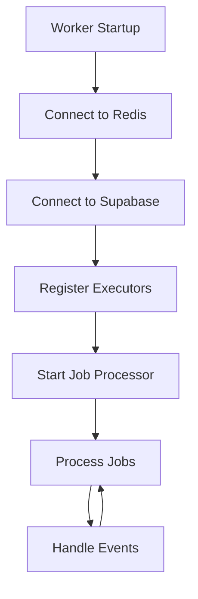

# Uvian Worker - Python Background Processing

[](https://www.python.org/)
[](https://python-poetry.org/)
[](https://docs.bullmq.io/)
[](https://runpod.ai/)
[](https://redis.io/)
[](https://supabase.com/)

**Uvian Worker** is the Python background processing service. It handles AI-powered chat processing, job queue management, and asynchronous operations using BullMQ, Redis, and integrations with RunPod for AI inference.


## **Core Architecture Patterns**

#### **1. Repository Pattern**

Clean data access with dedicated repositories for each entity:

- **JobRepository**: Background job management and status tracking
- **ConversationRepository**: Chat conversation handling
- **MessageRepository**: Message CRUD operations

### **2. Executor Pattern**

Modular job processing with specialized executors:

- **BaseExecutor**: Abstract base class defining the executor interface
- **ChatExecutor**: Specialized executor for AI chat processing

### **3. Event-Driven Architecture**

Redis pub/sub for inter-service communication:

- **Event Publishing**: Worker publishes events for API consumption
- **Event Subscription**: Worker subscribes to system events

---

## ⚙️ Job Processing Pipeline

### **Worker Lifecycle**



### **Job Processing Flow**

```typescript
// Step-by-step job processing pipeline
1. API creates job → Stores job in Supabase
2. API adds job to BullMQ queue
3. Worker fetches job from Redis
4. Worker updates job status to 'processing'
5. Worker dispatches to appropriate executor
6. Executor processes job (e.g., calls RunPod AI)
7. Worker updates job status to 'completed'/'failed'
8. Worker publishes result via Redis events
9. API receives event and broadcasts to WebSocket clients
```

## 📚 Additional Resources

- **Main Project README**: [`../../README.md`](../../README.md)
- **Architecture Guidelines**: [`.agents/rules/architecture.md`](../../.agents/rules/architecture.md)
- **Agent Guidelines**: [`../AGENTS.md`](../AGENTS.md)
- **Poetry Documentation**: [https://python-poetry.org/docs](https://python-poetry.org/docs)
- **BullMQ Documentation**: [https://docs.bullmq.io](https://docs.bullmq.io)
- **RunPod Documentation**: [https://runpod.ai/docs](https://runpod.ai/docs)
- **Supabase Python Client**: [https://supabase.com/docs/reference/python](https://supabase.com/docs/reference/python)

---

**Built with ❤️ using Python, asyncio, and modern async programming patterns.**
